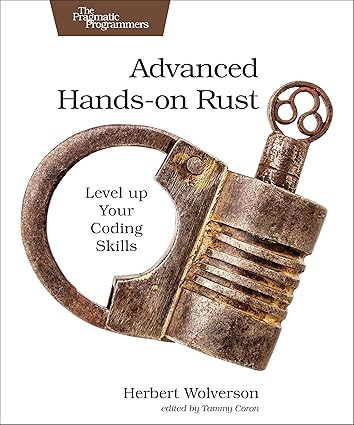

# About Herbert Wolverson

Hi, I'm Herbert Wolverson. I'm the Rust lead at Ardan Labs, and also the author of *Hands-on Rust*, *Rust Brain Teasers* and *Advanced Hands-on Rust*.

| Book | | Publisher E-Bool | Amazon |
|------|-| -----------------|--------|
| Hands-on Rust |  | [PragProg Page](https://pragprog.com/titles/hwrust/hands-on-rust/) | [Amazon Page](https://www.amazon.com/Hands-Rust-Effective-Learning-Development/dp/1680508164) |
| Rust Brain Teasers |  | [PragProg Page](https://pragprog.com/titles/hwrustbrain/rust-brain-teasers/) | [Amazon Page](https://www.amazon.com/Rust-Brain-Teasers-Pragmatic-Programmers/dp/1680509179) |
| Advanced Hands-on Rust |  | [PragProg Page](https://pragprog.com/titles/hwmrust/advanced-hands-on-rust/) | [Amazon Page](https://www.amazon.com/Advanced-Hands-Rust-Coding-Skills/dp/B0DHC6F1X2) |

> **Note:** I’m a little deaf and wear directional hearing aids.  
> If I don’t respond, I’m not ignoring you — I probably didn’t hear you.  
> Please don’t hesitate to point out if someone nearby needs help and I’ve missed them.
